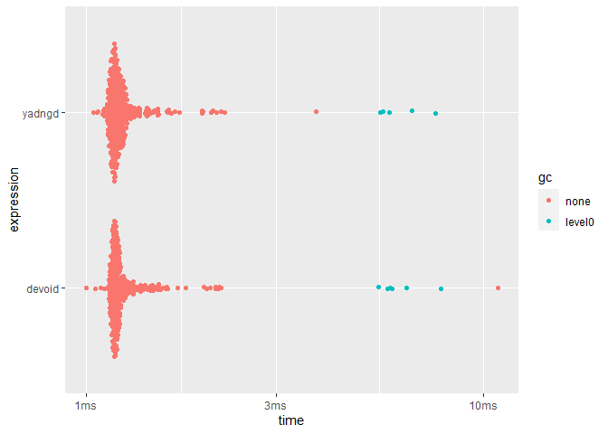

<!-- README.md is generated from README.Rmd. Please edit that file -->

# yadngd: Yet Another /dev/null Graphic Device using extendr

This repository is for testing
[extendr/extendr#360](https://github.com/extendr/extendr/pull/360)

<!-- badges: start -->
<!-- badges: end -->

## Installation

``` r
remotes::install_github("yutannihilation/yadngd")
```

## Usage

``` r
library(yadngd)

yadngd("◆祝◆ device activated!!! ◆祝◆", show_message = TRUE)
#> 🎉🍕🍰📺🍓✨🍣🐈🎿🎉🍕🍰📺🍓✨🍣🐈🎿
#> 
#>    ◆祝◆ device activated!!! ◆祝◆   
#> 
#> 🎉🍕🍰📺🍓✨🍣🐈🎿🎉🍕🍰📺🍓✨🍣🐈🎿

# "yadgnd" is on the list
dev.list()
#>     png yadndgd 
#>       2       3

# do nothing
plot(1)

# close the device
dev.off()
#> png 
#>   2
```

## Performance

(The code is from [r-lib/devoid](https://github.com/r-lib/devoid))

``` r
library(devoid)

point_coord <- seq_len(1e4)

void_plot <- function() {
  void_dev()
  plot(point_coord, point_coord)
  dev.off()
  NULL
}

yadngd_plot <- function() {
  yadngd("", show_message = FALSE)
  plot(point_coord, point_coord)
  dev.off()
  NULL
}

res <- bench::mark(
  devoid = void_plot(),
  yadngd = yadngd_plot(),
  min_iterations = 50
)

res[, 1:9]
#> # A tibble: 2 × 6
#>   expression      min   median `itr/sec` mem_alloc `gc/sec`
#>   <bch:expr> <bch:tm> <bch:tm>     <dbl> <bch:byt>    <dbl>
#> 1 devoid      996.5µs   1.19ms      792.     812KB     13.0
#> 2 yadngd       1.04ms   1.19ms      808.     809KB     10.7

plot(res)
#> Loading required namespace: tidyr
```


